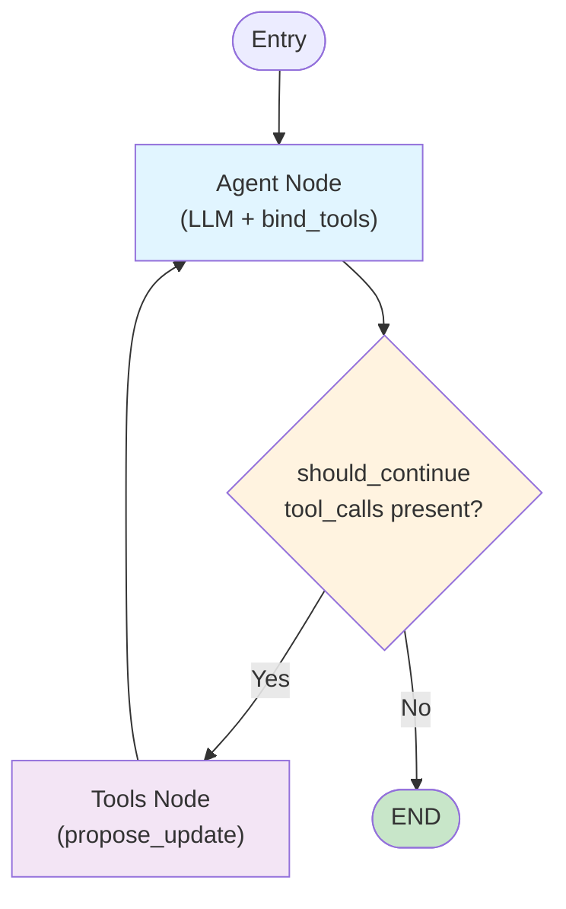

# Drafter AI — Stateful Document Editor

## Quick Overview

**Drafter** lets users iteratively edit documents with LLM help:
1. User requests a change → Agent proposes it (saved as **Draft** — non-destructive)
2. User asks for more changes → Agent builds on the Draft
3. User says "save" → Draft becomes permanent (creates **Revision**, increments **Document** version)

## Agent Graph



The LLM is bound to the `propose_update` tool. When called, it saves the proposal as a Draft in the database.

## Three Core Models

| Model | Purpose | When Created | Deleted? |
|-------|---------|--------------|----------|
| **Document** | Live version (id, title, content, version) | First | Never |
| **Draft** | In-progress proposal | Agent calls `propose_update` | On apply |
| **Revision** | Historical snapshot | When Draft is applied | Never |

## API Endpoints

```
POST   /documents/{id}/interact       → Run agent, iterate on draft
POST   /documents/{id}/apply-update   → Commit draft to document
GET    /documents/{id}/draft          → Fetch current draft
```

## How It Works: 3-Step Example

```
1. POST /documents/123/interact
   "Fix the grammar"
   → Draft created: "corrected text"
   → Response shows proposal

2. POST /documents/123/interact
   "Add more detail"
   → Agent reads Draft, adds detail
   → Draft updated: "corrected text + detail"
   → Response shows new proposal

3. POST /documents/123/interact
   "Yes, save it"
   → Confirmed! apply_draft() called
   → Revision created (stores old content)
   → Document.version++ (v1 → v2)
   → Draft deleted
   → Response: "Changes saved. Document updated to version 2."
```

## Logging

All operations logged to console + `drafter.log`. Set `LOG_LEVEL=DEBUG` in `.env` for verbose output.

## Setup

```bash
pip install -r requirements.txt
# Configure .env (DATABASE_URL, LLM_PROVIDER, etc.)
uvicorn app.main:app --reload
```

Done. The agent always works on the **Draft**, so changes stack cumulatively until you confirm.

